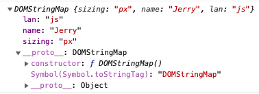
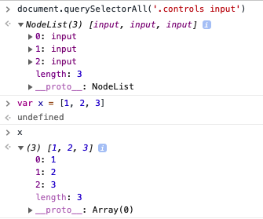

# Day 03 Update CSS Variables with JS

使用 JavaScript 实时修改 CSS 的属性，本例中修改了图片的 padding，背景色以及高斯模糊的 blur 值。

## 技术要点

  1. **:root** 伪类
  2. **data-\*** 自定义属性的集合 `dataset`

## 伪类 **:root**

`:root` 匹配了 DOM 的根元素。对于 HTML 来说，`:root` 表示的是 `<html>` 元素，除了具有更高的优先级之外，与 `html` 选择器相同。

示例中，通过 `:root` 伪类，定义了全局的 CSS 变量：

``` CSS
:root {
    --base: #ffc600;
    --spacing: 10px;
    --blur: 0px;
}

/* 在用到全局变量的地方的 使用 var(--base) 的形式 */ 
img {
    background: var(--base);
    padding: var(--spacing);
    filter: blur(var(--blur));
}
```

## data-* 自定义属性的集合 `dataset`

第一天的爵士鼓练习中，用到了 **data-\*** 这样的自定义属性，例如有下面这样的 HTML 元素标签

``` HTML
<input type="range" name="spacing" min="10" max="200" value="10" data-sizing="px" data-name="Jerry" data-lan="js">
```

`this.dataset` 获取到的集合如下图



## document.querySelectorAll() 不是一个 Array

这里需要提醒一下通过 `document.querySelectorAll('xxx')` 获取到的不是一个 `Array` 而是一个 `NodeList` 类型的对象。可以在控制台中得到验证

``` JavaScript
// 可以通过 Array.from 来转换
Array.from(document.querySelectorAll('.controls input'));
```


